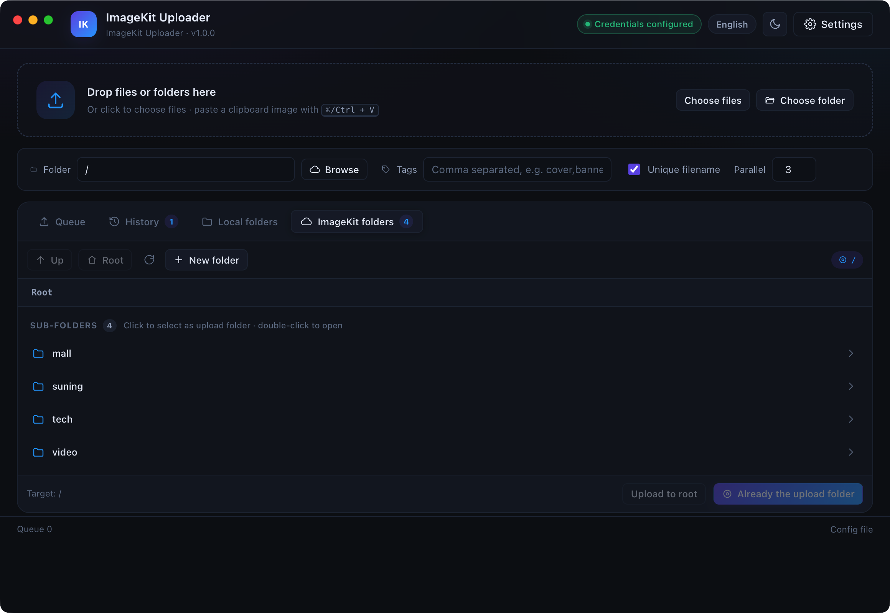

# ImageKit Uploader

**English** · [简体中文](./README.zh-CN.md)

A desktop uploader for [imagekit.io](https://imagekit.io/) built with **Electron + React + Vite + TypeScript**, targeting **macOS** and **Windows**.

The Public Key, Private Key, and Name all live in the app's **config file**. Change the config later and it takes effect immediately — no rebuild required.



---

## Features

| Capability | Description |
| --- | --- |
| Three ways to add files | Drag & drop, file picker, or paste a clipboard screenshot with `⌘/Ctrl + V` |
| Concurrent queue | 3 uploads in parallel by default (adjustable 1–8), per-file progress bar, retry on failure, cancel mid-flight |
| Direct upload | HMAC-SHA1 signing and uploading happen in the main process — no relay service involved |
| Upload options | Folder, tags, and unique-filename per batch, adjustable from the UI |
| Local directory browsing | Pick a folder on your machine, list its sub-directories and files, then select files to enqueue |
| Cloud directory browsing | Browse existing ImageKit folders and uploaded files (with thumbnails). **Click a folder to set it as the upload target**; double-click (or hit `→`) to enter it |
| One-click copy | Copy URL / Markdown / HTML / all links |
| History | The last 300 successful uploads, persisted locally, copyable and deletable |
| Themes | Dark / light / follow system |
| Language | English / 简体中文, **English by default**, switchable at runtime and remembered across restarts |
| No key leakage | The Private Key stays in the main process and the local config file; the renderer never sees it |

---

## Quick Start

```bash
# 1. Install dependencies
npm install

# 2. Development mode (hot reload)
npm run dev

# 3. Production build (compile only, no installers)
npm run build

# 4. Package installers
npm run build:mac     # → release/*.dmg (Apple Silicon + Intel)
npm run build:win     # → release/*-setup.exe (NSIS installer, run on Windows)
npm run build:all     # Produce both mac + win
npm run build:unpack  # Unpacked directory only, handy for local verification
```

> Building the Windows installer on macOS requires Wine. It's best to run `npm run build:win` on a Windows machine or in CI.

---

## Configuration (Public Key / Private Key / Name)

### 1. Get your credentials

Sign in to the imagekit.io dashboard → **Developer Options → API Keys** and grab:

- `Public Key` (looks like `public_xxxxxxxx`)
- `Private Key` (looks like `private_xxxxxxxx` — **this is a sensitive credential**)
- `URL Endpoint` (looks like `https://ik.imagekit.io/your_imagekit_id`), found on the **URL-endpoints** page

### 2. Config file location

`config.json` is created automatically on first launch:

| OS | Path |
| --- | --- |
| macOS | `~/Library/Application Support/ImageKit Uploader/config.json` |
| Windows | `%APPDATA%\ImageKit Uploader\config.json` |

You can also point the app at any path with the `IMAGEKIT_UPLOAD_CONFIG` environment variable — useful for keeping the config on a USB drive or inside a project folder.

### 3. Config fields

```json
{
  "name": "ImageKit Uploader",
  "publicKey": "public_xxxxxxxxxxxxxxxxxxxxxxxxxxxx",
  "privateKey": "private_xxxxxxxxxxxxxxxxxxxxxxxxxxx",
  "urlEndpoint": "https://ik.imagekit.io/your_imagekit_id",
  "defaultFolder": "/uploads",
  "defaultTags": "",
  "useUniqueFileName": true,
  "concurrency": 3,
  "theme": "dark",
  "customEndpoint": "",
  "apiEndpoint": "",
  "language": "en"
}
```

| Field | Type | Description |
| --- | --- | --- |
| `name` | string | App display name / account label, shown in the window title bar |
| `publicKey` | string | ImageKit Public Key |
| `privateKey` | string | ImageKit Private Key, used to generate upload signatures |
| `urlEndpoint` | string | CDN endpoint, used to join `filePath` into the final URL |
| `defaultFolder` | string | Default upload folder, `/` means the root |
| `defaultTags` | string | Default tags, comma-separated |
| `useUniqueFileName` | boolean | When `true`, same-name files get a suffix instead of overwriting |
| `concurrency` | number | Number of concurrent uploads, 1–8 |
| `theme` | `"dark" \| "light" \| "system"` | UI theme |
| `customEndpoint` | string | Custom upload endpoint; leave empty to use the official `upload.imagekit.io` |
| `apiEndpoint` | string | Management API base URL; leave empty to use `https://api.imagekit.io/v1` |
| `language` | `"en" \| "zh"` | Interface language, **defaults to `"en"`**; unknown values fall back to English |

### 4. Two ways to change it

1. **In the UI**: click **Settings** in the top right, fill in the fields, then **Save**. You can also click **Save & Test Connection** to verify the credentials right away.
2. **Edit the file**: open `config.json` in an editor, save, then click **Settings → Reload Config** in the app. No restart needed.

See [`config.example.json`](./config.example.json) for the template.

> ⚠️ The `privateKey` is as sensitive as an account password. Never commit it to Git or ship it inside a build. `.gitignore` already excludes `config.local.json` and `.env`.

### 5. Switching the interface language

The UI ships in **English (default)** and **Simplified Chinese**. Three equivalent ways to switch:

| Where | How |
| --- | --- |
| Header badge | Click the language chip (`English` / `简体中文`) next to the theme button — toggles instantly |
| Settings | **Settings → Interface → Language**, pick a segment |
| Config file | Set `"language": "zh"` and click **Reload Config** |

The choice is written to `config.json` right away and is picked up on the next launch. `theme` and `language` apply immediately without saving; other fields in the Settings dialog still need **Save`.

> The whole interface is localized — including main-process error messages, native file dialogs, and the comments at the top of the generated `config.json`. That header is regenerated in the current language on the next save.

---

## Project Structure

```
imageKit-upload/
├── .github/workflows/
│   ├── ci.yml                   # push/PR: typecheck + build all three targets
│   └── release.yml              # tags: build dmg / exe and publish a Release
├── build/                       # Packaging assets (app icons etc.), see build/README.md
├── electron.vite.config.ts      # Main / preload / renderer build config
├── electron-builder.yml         # mac dmg + win nsis packaging config
├── config.example.json          # Config template
├── README.md                    # This file (English, default)
├── README.zh-CN.md              # Simplified Chinese version
├── src/
│   ├── shared/
│   │   ├── types.ts             # Types shared by main and renderer
│   │   └── i18n.ts              # en/zh message dictionaries + translate()
│   ├── main/                    # Main process (Node side, holds the Private Key)
│   │   ├── index.ts             # Window creation + all IPC handlers
│   │   ├── config.ts            # config.json read/write and validation
│   │   ├── lang.ts              # Main-process language holder (errors, dialogs)
│   │   ├── imagekit.ts          # HMAC-SHA1 signing + chunked upload + connection test
│   │   ├── history.ts           # Upload history persistence
│   │   ├── fs.ts                # Local directory listing / file collection
│   │   └── mime.ts              # Extension → MIME
│   ├── preload/index.ts         # contextBridge allow-list API
│   └── renderer/                # Renderer process (React UI)
│       ├── index.html
│       └── src/
│           ├── App.tsx          # State orchestration + concurrency scheduling
│           ├── components/      # Header / drop zone / queue / history / settings / toasts
│           ├── hooks/           # Toasts, local & remote directory browsing
│           ├── lib/
│           │   ├── i18n.tsx     # I18nProvider + useT()/useI18n()
│           │   └── ...          # Theme, formatting, clipboard helpers
│           └── styles/index.css # Light & dark theme styles
```

---

## Internationalization

All UI copy lives in **`src/shared/i18n.ts`**: a flat, dotted message key → text map.

- `en` is the single source of truth. `MessageKey` is derived from it, and the `zh` dictionary is typed as `Record<MessageKey, string>` — so a missing or misspelled translation fails `npm run typecheck` instead of silently falling back.
- Placeholders use `{name}` and are substituted by `translate(lang, key, params)`.
- The renderer gets `t` from `useT()` / `useI18n()` (React context in `src/renderer/src/lib/i18n.tsx`); the main process calls `mainT()` from `src/main/lang.ts`, which tracks the language synced from `config.json` on every load.
- The interface language also drives the main-process errors, the native dialog titles, and `<html lang>`.
- Cancellation is detected with `isCanceledMessage()`, which matches the string against every supported language — never hard-code a translated string in a comparison.

To add a language: add the code to `Language`, add `LANGUAGE_LABELS`, and add a dictionary typed as `Record<MessageKey, string>`. TypeScript will list every key you still need to translate.

---

## How Uploads Work

ImageKit requires upload requests to carry auth parameters signed with the Private Key:

```
token     = random UUID
expire    = current timestamp + 1800 seconds
signature = HMAC-SHA1(privateKey, token + expire)
```

The request is a `multipart/form-data` POST to `https://upload.imagekit.io/api/v1/files/upload` with the fields
`file`, `fileName`, `publicKey`, `signature`, `expire`, `token`, `folder`, `tags`, and `useUniqueFileName`.

Both signing and uploading happen in the **main process**; the renderer only receives the result over IPC, so the Private Key never enters the web context.

---

## Cloud Directory Browsing

The **Cloud** tab reads ImageKit's management API directly (`GET /v1/files?type=all&path=...`) and lists
the **sub-directories** and **already-uploaded files** (images include thumbnails) of the current directory.
It also doubles as the "pick an upload folder" entry point:

| Action | Behavior |
| --- | --- |
| **Click** a folder name | Sets that folder as the **target folder for this batch** (the row highlights with an "Upload target" badge, and the top bar and footer stay in sync) |
| **Double-click** a folder name / click the `→` button | Enters that folder |
| Breadcrumbs / Up / Root | Pure browsing — the upload target is not changed |
| Footer "Upload to {current folder}" | Sets the **folder you are currently browsing** as the upload target in one click |
| Top bar "Browse" button | Opens a dialog to pick a folder anywhere as the upload target |

Folder names are compared using normalized paths, so `/a/`, `/a`, and `a` are treated as the same folder.
Note that ImageKit folders are virtual: a newly created folder has a 1–2 second indexing delay, and the UI retries automatically.

---

## Automated Builds (GitHub Actions)

Two workflows ship with the repo, both under `.github/workflows/`:

| Workflow | Trigger | What it does |
| --- | --- | --- |
| `ci.yml` | Push to `main`/`master`, pull requests, manual | Runs `npm run typecheck` + `npm run build` on Ubuntu to verify the code compiles (no installers) |
| `release.yml` | Push a `v*` tag, manual | Builds dmg / exe on `macos-14` and `windows-latest`; a tag push also creates a GitHub Release |

### Publishing a release

```bash
# 1. Bump the version in package.json to the target (e.g. 1.0.1)
git commit -am "chore: release v1.0.1"

# 2. Tag and push — the workflow starts packaging and publishing
git tag v1.0.1
git push origin main --tags
```

When it finishes, the **Releases** page shows three artifacts:
`imagekit-upload-1.0.1-arm64.dmg`, `imagekit-upload-1.0.1-x64.dmg`, and `imagekit-upload-1.0.1-setup.exe`.

> The workflow overwrites `package.json`'s `version` with the version from the tag
> (`npm version ${tag#v}`), so the tag wins if the two disagree.

To produce artifacts without publishing a Release, run **Actions → Release → Run workflow** manually
and download them from the run's Artifacts section (kept for 7 days).

### About code signing

Artifacts are currently **unsigned** (`identity: null` in `electron-builder.yml`):

- **macOS**: The first launch may report the app is "damaged" or from an unidentified developer. Right-click → **Open**,
  or run `xattr -cr "/Applications/ImageKit Uploader.app"`.
- **Windows**: SmartScreen will warn you; click **More info → Run anyway**.

To sign properly, add `CSC_LINK` (the base64 of your p12 certificate) and `CSC_KEY_PASSWORD` under
**Settings → Secrets and variables → Actions**, then remove `identity: null` from `electron-builder.yml`.
No workflow changes are needed.

### About the package registry

The local `.npmrc` points at `registry.npmmirror.com` (fast for development in China), while CI runs on overseas
machines. Both workflows temporarily switch back to `registry.npmjs.org` via the `NPM_CONFIG_REGISTRY` environment
variable, so the repo's `.npmrc` does not need to be changed.

---

## Troubleshooting

**`npm run dev` fails with `Cannot read properties of undefined (reading 'requestSingleInstanceLock')`**

Your terminal has `ELECTRON_RUN_AS_NODE` set, so Electron starts as plain Node. Unset it:

```bash
# macOS / Linux
env -u ELECTRON_RUN_AS_NODE npm run dev

# Windows PowerShell
Remove-Item Env:\ELECTRON_RUN_AS_NODE; npm run dev
```

**Upload returns 401 / 403**

The Private Key is wrong, or the key lacks Files permission. Go to **Settings** and click **Save & Test Connection** to pinpoint the issue.

**Upload succeeds but the link does not open**

`urlEndpoint` is missing or incorrect. Fill it in and re-upload, or copy the `url` field from the history entry (the address ImageKit returns directly).

**Windows packaging fails**

Run `npm run build:win` on Windows or in CI; cross-compiling from macOS requires Wine.

---

## Tech Stack

Electron 33 · React 18 · Vite 5 · TypeScript 5 · electron-vite · electron-builder

## License

MIT
